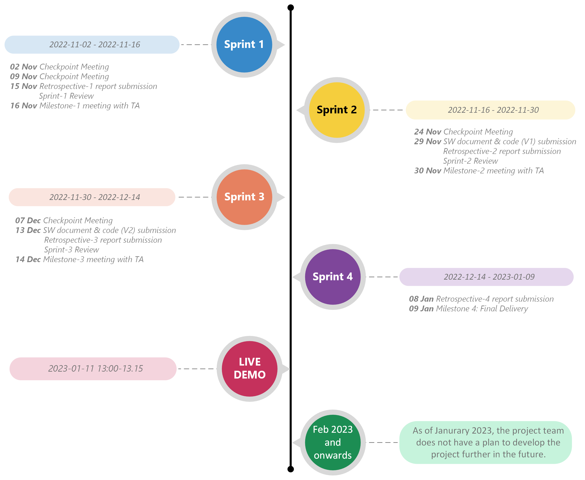

# Documentation (Last update: 2023-01-03)

# About the Project

## Name
Dens Cura: Distributed dental clinic booking system

## Description
It is undoubtable that dental health is crucial to one's well-being. For its importance, a modern society is expected to support a decent dental care of the people. This support includes a right to get a dental care in a timely manner without travelling too far fron one's residence. These features are facilitated by the online booking system that support easy and effienct reservation of timeslot in dental clinics. Despite the importance, not every society is equipped with the dental clinic booking system that satisfies all residents' needs; one example is the Västra Götaland county in Sweden.

As of autumn 2022, the only web-service for online dental clinic booking is Folktandvården, the Public Dental Service in Västra Götaland country. Although this service provides the users with multiple functionalities, there are several limitations that can be improves for higher customer satisfaction. One of the major issues is that the current Folktandvården system only covers search for public dental clinics and excludes numerous private clinics. Moreover, in the current system the user should manually filter the geographical search area as the system is not using the current location of the user connected to a map.

The project aims to develop a brand-new distributed system for dental clinic booking which overcomes the identified challenges in the current setting; that is, to provide the user with access to all dental clinics in the city of Gothenburg. The project team consists of eight student developers. The initial and foundational requirements were provided by the university of Gothenburg to ensure the quality of the software. Additionally, the project team has been added creativity in the project to maximize the user satisfaction.

## Development Team

| Team member | Main Role | Tasks |
| ------ | ------ | ------ |
| Mijin Kim | Product Owner, Developer | Product backlog maintanance, contact point with clients, software development |
| Erik Harring | Scrum Master, Developer | Support agile practice in the team, software development |
| Christopher Andersson | Developer | Software Development |
| Jonathan Bergdahl | Developer | Software Development |
| Sanna Evertsson | Developer | Git Responsible, Software Development |
| William Hilmersson | Developer | Software Development |
| Patricia Antunes Marklund | Developer | Kanban Board Responsible, Software Development |
| Anna Törngren | Developer | Software Development |

## Project repositories
To implement the distributed nature of *Dens Cura*, the system has been developed in the following five repositories in GitLab:
- [Booking Backend](https://git.chalmers.se/courses/dit355/dit356-2022/t-10/booking-backend)
- [Clinic backend](https://git.chalmers.se/courses/dit355/dit356-2022/t-10/booking)
- [Frontend](https://git.chalmers.se/courses/dit355/dit356-2022/t-10/frontend)
- [Broker](https://git.chalmers.se/courses/dit355/dit356-2022/t-10/broker)
- [Filter](https://git.chalmers.se/courses/dit355/dit356-2022/t-10/filter)

## Software Requirement Specification (SRS)
This is a living document that all team members are updating frequently. As the readme file is not a suitable place to keep these changes, the SRS documentation is maintained in a shared document.
This part will be updated before the final submission.

## Software Architecture Document (SAD)
### Component diagram

# Project Management Report (PMR)

## Project management practices used
The project team has actively adopted the principles of Scrum in combination with Kanban.
- The important Scrum decisions that the development team has been made are:
  - Election of a Product Owner (PO) and a Scrum Master (SM)
  - The project consists of multiple sprints
  - Diverse Scrum artifacts; e.g. product backlog, sprint backlog
  - Diverse sprint rituals; e.g. sprint planning, sprint review and sprint retrospective
- [A kanban board in Trello](https://trello.com/b/mpXIOkcb/dit-356-2022-team-10)  has been used to facilitate the team's work with visual presentation of tasks

## Important project management decisions (regarding schedule and scope)

*Iteration week 1 (Sprint 1)* 
- The team created a team contract to reach agreement on the common aim, vacation days as well as basic guidelines for the team work.
- The team has been agreed on communication channels and the way of communication.
- The team decided to actively adopt the Scrum practices with certian variations.
- Roles of the team members have been decided after analyzing each member's strength.
  - The Project Owner and Scrum Master of the team has been decided. This will not change during the project cycle due to short time period.
  - All members got a position as a software developer.
  - Additionally, Git responsible and Trello responsible have been selected.
- Based on specific milestone dates provided by the project sponsor, the timeframe of four sprints has been decided.
- Considering the sprint schedule, plans and dates for regular Scrum events were decided.
  - Every Tuesday and Thursday, the team will conduct a 15-minutes daily Scrum meeting.
  - A sprint meeting shall be held one day before the milestone of each sprint.
  - There should be two sprint review sessions per sprint:
    - The first sprint review shall be conducted a day before the milestone date at a team level (including Product Owner and Scrum Master).
    - The second sprint review shall be conducted on the milestone date with the Scrum team and the teaching assistence of the course.
  - Sprint planning shall be made shortly after the latter sprint review. In a sprint meeting, product backlog shall be refined and a new sprint backlog shall be created.
  
*Iteration week 2 (Sprint 1)*
- Continued from the previous iteration, the team have agreed to spend iteration 2 for the project planning. Furthermore, the team made a rough plan of the focus of the software development during the project cycle as below:
  - *Sprint 1 (current sprint)*: Finalizing project planning
  - *Sprint 2*: Back-end development
  - *Sprint 3*: Front-end development
  - *Sprint 4*: Integration of the back-end and front-end & resolving any issue in development
- Based one the grading criteria of the course, the team agreed on minimum viable products to deliver and also created a list of optional features which could be implemented to add extra value to the product; i.e. login functionality and the level of GUI aesthetics.

*Iteration week 3 (Sprint 2)*
- The original sprint-2 backlog has been updated during the sprint as the backlog items had to be broken down further to faciliate the members' work.

*Iteration week 4 (Sprint 2)*
- The sprint review and sprint retrospective which originally scheduled on 30th November with the TA have been changed to 29th November considering the deadline of retrospective-2 submission being on 30th of November.
- The team members have worked efficiently during the iteration and have finished many items in the sprint-2 backlog earlier than the estimation. Therefore, the team has started working on several front-end related features in the product backlog, which were planned to be done in the upcoming sprint.
  
*Iteration week 5 (Sprint 3)*
- In the original project scope, the team has decided to implement a login functionality by verifying user with a login token. However, the team encountered several issues with login functionality which hinders the progress of all related tasks. The team has decided to commit a day to fix the issue(7th of December). If the issue cannot be solved, the login functionality shall be excluded out of the project scope.

*Iteration week 6 (Sprint 3)* 
  There was a significant change in the project scope and the software architecture.
  - Change in the project scope: The user-related functionalities, which the team has been put a lot of effort and time, started to cause issues in the project and take a lot more time than the team has estimated. As they are not mandatory requirements of the course, the team has decided to move them out of the scope in order to commit all the resources into the more important tasks.
  - Change in the software architecture: Before the scope change, the team had four separate components (repositories) including User Backend repository which contains all user-related functionalities such as login, registration and user sessions. As the team decided to remove the user-related functionalities out of the scope, the User Backend is no longer in use. This leads the team to have only three independent components in the system, which does not satisfy the grading criteria; i.e. at least four independent components are required in the system. Thus, the team had to split Clinic Backend repository into Clinic Backend and Booking Backend repository.
  - The team has completed all necessary features about booking functionlities by the end of Sprint 3. All remaining t -features and documentation will be conducted in Sprint 4 according to the original schedule.

*Iteration week 7 (Sprint 4)*
- There was no change in the schedule and the scope.

*Iteration week 8 (Sprint 4)*
- There was no change in the schedule and the scope.

## Usage

## Roadmap and project status
