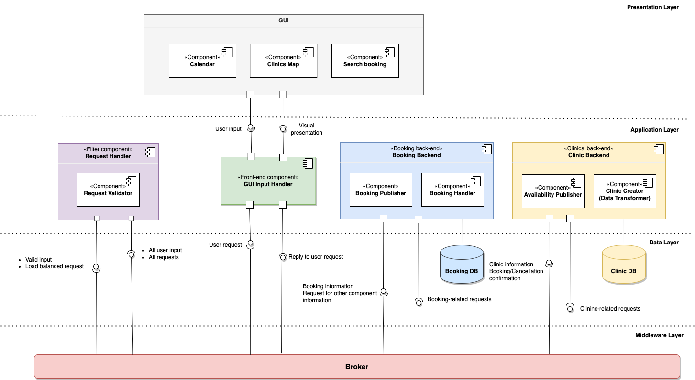

# Documentation (Last update: 2023-01-03)

# About the Project

## Name
Dens Cura: Distributed dental clinic booking system

## Description
It is undoubtable that dental health is crucial to one's well-being. For its importance, a modern society is expected to support a decent dental care of the people. This support includes a right to get a dental care in a timely manner without travelling too far fron one's residence. These features are facilitated by the online booking system that support easy and effienct reservation of timeslot in dental clinics. Despite the importance, not every society is equipped with the dental clinic booking system that satisfies all residents' needs; one example is the Västra Götaland county in Sweden.

As of autumn 2022, the only web-service for online dental clinic booking is Folktandvården, the Public Dental Service in Västra Götaland country. Although this service provides the users with multiple functionalities, there are several limitations that can be improves for higher customer satisfaction. One of the major issues is that the current Folktandvården system only covers search for public dental clinics and excludes numerous private clinics. Moreover, in the current system the user should manually filter the geographical search area as the system is not using the current location of the user connected to a map.

The project aims to develop a brand-new distributed system for dental clinic booking which overcomes the identified challenges in the current setting; that is, to provide the user with access to all dental clinics in the city of Gothenburg. The project team consists of eight student developers. The initial and foundational requirements were provided by the university of Gothenburg to ensure the quality of the software. Additionally, the project team has been added creativity in the project to maximize the user satisfaction.

## Development Team

| Team member | Main Role | Tasks |
| ------ | ------ | ------ |
| Mijin Kim | Product Owner, Developer | Product backlog maintanance, contact point with clients, Software development |
| Erik Harring | Scrum Master, Developer | Support agile practice in the team, Software development |
| Christopher Andersson | Developer | Software Development |
| Jonathan Bergdahl | Developer | Software Development |
| Sanna Evertsson | Developer | Git Responsible, Software Development |
| William Hilmersson | Developer | Software Development |
| Patricia Antunes Marklund | Developer | Kanban Board Responsible, Software Development |
| Anna Törngren | Developer | Software Development |

## Project repositories
To implement the distributed nature of *Dens Cura*, the system has been developed in the following five repositories in GitLab:
- [Booking Backend](https://git.chalmers.se/courses/dit355/dit356-2022/t-10/booking-backend)
- [Clinic backend](https://git.chalmers.se/courses/dit355/dit356-2022/t-10/booking)
- [Frontend](https://git.chalmers.se/courses/dit355/dit356-2022/t-10/frontend)
- [Broker](https://git.chalmers.se/courses/dit355/dit356-2022/t-10/broker)
- [Filter](https://git.chalmers.se/courses/dit355/dit356-2022/t-10/filter)

## Software Requirement Specification (SRS)
1. General Requirements: 
1.1. The system shall have 4 distributed and independent components.  
1.2. The application shall not break when a faulty input is received. 

2. Frontend: 
2.1. The system shall allow users to book appointments with dental clinics. 
2.2. The system shall contain a map-view over Gothenburg that can be navigated. 
2.3. The system shall have a calendar displaying the times for booking. 
2.4. The system shall display only the times that are available for booking. 
2.5. The system shall display a message in case a user clicks on a time that is already booked. 
2.6. The system shall display a confirmation message when a booking is confirmed. 
2.7. The system shall have an option to find an existing booking. 
2.8. The system shall allow the user to cancel an existing booking. 

3. Booking Backend: 
3.1. The system shall make changes to booking availability as simultaneous bookings happen. 
3.2. The system shall reserve the time chosen in the calendar by the user for 5 minutes. 
3.3. The system shall cancel the reservation if the booking is not confirmed within 5 minutes. 
3.4. The booking shall contain email, SSN, first and last name of the user. 

4. Clinic Backend: 
4.1. The booking slots shall have 30 minutes of duration. 
4.2. The booking shall require one dentist. 
4.3. The system shall allocate a lunch break of 1 hour per day to the dentist. 
4.4. The system shall allocate a Fika break of 30 minutes per day. 

5. Filter: 
5.1. The system shall verify if booking requests are in JSON format. 
5.2. The system shall connect to the broker using MQTT.  
5.3. The system shall connect to teh frontend using HTTP. 

6. Broker: 
6.1. The system shall have middleware based on the MQTT protocol. 
6.2. Booking requests and responses shall be handled through MQTT. 
6.3. Stopped components must unsubscribe from the MQTT broker. 
6.4. The system shall guarantee a QoS level 2 for all MQTT messages where possible. 

## Software Architecture Document (SAD)

Dens Cura is a distributed system with five components that communicate with a publish-subscribe communication protocol. This architectural style allows for data transfer between all components connected. For example, the frontend publishes a request to create a booking and the booking backend subscribing to this topic receives the request and handles it. This allows for good scalability and flexibility while still making it easy to add further subscribers.  

Furthermore, for transformation of data is handled in a pipe and filter part of the system which allows for both maintainability and interoperability. This is since the filters can be changed, added or deleted without impacting other filters.  

### Architecture Styles and Design Patterns: 

- Publish and Subscribe 

- Client-Server  

- Layered Architecture 

- MVC(Model-View-Controller) 

- Pipe-Filter 

- Broker 

- Circuit Breaker

### Conceptual design 

Dens Cura is a system designed to solve an emerging problem in Sweden. The number of dentistry clinics is increasing year after year, and they are mostly using their own booking system. The result is that if you want to find time with a dentist you have to scour through sites looking for a time that fits you, and many times there is none.  
To solve this we are developing Dens Cura, a service that congregates all the available dentistry times in one place. A map over Gothenburg will make it easy to find a clinic near you and an easy-to-understand calendar will give an overview of which times are available soon. 

 

### Design decision and tactics 

Dens Cura is designed as a quad-component distributed system which mainly communicates using an MQTT broker. The MQTT system was chosen for its high efficiency, fast communication and reliability. Using quality of service level 2(QoS2) it is guaranteed that each message is delivered once. 

When developing Dens Cura the team planned for a level of emergent design to reduce the upfront planning cost. The system uses a load balancer to improve the availability and reliability by distributing the workload evenly among the nodes available. However, in the case of a high amount of traffic (or a denial-of-service attack) there is a circuit breaker that can trigger and prevent cascading failures.  

For simplicities sake and to allow for horizontal expansion the data about bookings and clinics are stored in a document database. 

### Deployment diagram

### Component diagram

# Project Management Report (PMR)

## Project management practices used
The project team has actively adopted the principles of Scrum in combination with Kanban.
- The important Scrum decisions that the development team has been made are:
  - Election of a Product Owner (PO) and a Scrum Master (SM)
  - The project consists of multiple sprints
  - Diverse Scrum artifacts; e.g., product backlog, sprint backlog
  - Diverse sprint rituals; e.g., sprint planning, bi-daily stand-ups, sprint review and sprint retrospective
- [A kanban board in Trello](https://trello.com/b/mpXIOkcb/dit-356-2022-team-10)  has been used to facilitate the team's work with visual presentation of tasks
- Each sprint started with a sprint planning where the team has decided the tasks, broken down large tasks and assigned tasks to members based on time estimation which was made considering each member's capability and availability.
- Approximately every other day the team has had a stand-up meeting to discuss their progress, share issues and their plans for the upcoming two days with the other developers. 
- Each sprint ended with a sprint retrospective and a sprint review.
  - In the sprint retrospectives, the team has reflected on how the agile practices had been used during the sprints as well as has discussed how the project, from the agile perspective, can be improved. The result of the sprint retrospectives is documented in each retrospective document and handed in on Canvas.
  - In each sprint, two sprint review sessions have been conducted. First sprint review sessions have been held at the team level, where the team discussed the performance during the sprints; this is what has been written in retrospective report submissions. For the second sprint reviews, the teaching assistant assigned to the team has also participated to provide constructive feedback. The results of the second sprint review sessions are reflected in the upcoming sprint's backlog creation and potential changes in the project scope.

## Important project management decisions (regarding schedule and scope)

*Iteration week 1 (Sprint 1)* 
- The team created a team contract to reach agreement on the common aim, vacation days as well as basic guidelines for the team's work.
- The team has been agreed on communication channels and the way of communication.
- The team decided to actively adopt the Scrum practices with certain variations.
- Roles of the team members have been decided after analyzing each member's strength.
  - The Project Owner and Scrum Master of the team has been decided. This will not change during the project cycle due to the short time period.
  - All members got positions as software developers.
  - Additionally, Git responsible and Trello responsible have been selected.
- Based on specific milestone dates provided by the project sponsor, the timeframe of four sprints has been decided.
- Considering the sprint schedule, plans and dates for regular Scrum events were decided.
  - Every Tuesday and Thursday, the team will conduct a 15-minute daily Scrum meeting.
  - A sprint meeting shall be held one day before the milestone of each sprint.
  - There should be two sprint review sessions per sprint:
    - The first sprint review shall be conducted a day before the milestone date at a team level (including Product Owner and Scrum Master).
    - The second sprint review shall be conducted on the milestone date with the Scrum team and the teaching assistant of the course.
  - Sprint planning shall be made shortly after the latter sprint review. In a sprint meeting, the product backlog shall be refined and a new sprint backlog shall be created.
  
*Iteration week 2 (Sprint 1)*
- Continued from the previous iteration, the team have agreed to spend iteration 2 for the project planning. Furthermore, the team made a rough plan of the focus of the software development during the project cycle as below:
  - *Sprint 1 (current sprint)*: Finalizing project planning
  - *Sprint 2*: Back-end development
  - *Sprint 3*: Front-end development
  - *Sprint 4*: Integration of the back-end and front-end & resolving any issue in development
- Based on the grading criteria of the course, the team agreed on minimum viable products to deliver and created a list of optional features which could be implemented to add extra value to the product; i.e., login functionality and the level of GUI aesthetics.

*Iteration week 3 (Sprint 2)*
- The original sprint-2 backlog has been updated during the sprint as the backlog items had to be broken down further to facilitate the members' work.

*Iteration week 4 (Sprint 2)*
- The sprint review and sprint retrospective which originally scheduled on 30th November with the TA have been changed to 29th November considering the deadline of retrospective-2 submission being on 30th of November.
- The team members worked efficiently during the iteration and finished many items in the sprint-2 backlog earlier than the estimation. Therefore, the team has started working on several front-end related features in the product backlog, which were planned to be done in the upcoming sprint.
  
*Iteration week 5 (Sprint 3)*
- In the original project scope, the team has decided to implement a login functionality by verifying user with a login token. However, the team encountered several issues with login functionality which hinders the progress of all related tasks. The team has decided to commit a day to fix the issue (7th of December). If the issue cannot be solved, the login functionality shall be excluded out of the project scope.

*Iteration week 6 (Sprint 3)* 
  There was a significant change in the project scope and the software architecture.
  - Change in the project scope: The user-related functionalities, which the team has been putting a lot of effort and time into, started to cause issues in the project and take a lot more time than the team had estimated. As they are not mandatory requirements of the course, the team has decided to move them out of the scope in order to commit all the resources into the more important tasks.
  - Change in the software architecture: Before the scope change, the team had four separate components (repositories) including User Backend repository which contains all user-related functionalities such as login, registration and user sessions. As the team decided to remove the user-related functionalities out of the scope, the User Backend is no longer in use. This leads the team to have only three independent components in the system, which does not satisfy the grading criteria; i.e., at least four independent components are required in the system. Thus, the team had to split Clinic Backend repository into Clinic Backend and Booking Backend repository.
  - The team has completed all necessary features about booking functionalities by the end of Sprint 3. All remaining features and documentation will be conducted in Sprint 4 according to the original schedule.

*Iteration week 7 (Sprint 4)*
- There was no change in the schedule and the scope.
- As planned before, the team has focused on completing tasks in the sprint backlog before the vacation begins.

*Iteration week 8 (Sprint 4)*
- There was no change in the schedule and the scope.
- As planned before, the team has focused on completing all planned tasks to ensure the project success. This includes finishing all mandatory and optional features as well as submitting the retrospective-4 report.

## Usage

    
# *Installation and get started guide* 
This is the developer guide for Dens Cura.  
The aim of this guide is to have all the information needed to continue developing  
 the project using our repository. During development we used a mix of Windows, Linux(Ubuntu) and MacOS. If you have a question, feel free to reach out to any of the creators. 
   
## **The technologies and systems used in Dens Cura:** 
* For all of our repositories we used **JavaScript**. 
* The frontend uses **Vue-Bootstrap**. 
* Most of our developers used **Visual Studio Code**(VSC). 
* To handle our packets we used **Node Packet Manager**(NPM). 
* During the project we kept our project on a **GitLab** hosted by Chalmers University of Technology. 
  
## **What you need to get started:** 
**IDE** 
* We suggest using Visual Studio Code if you are new to web development, as there is an abundande of online resrources about it. [Download](https://code.visualstudio.com/)  
**Node** 
* To continue developing the project you need Node-js installed. TThe following versions were used in the development: Windows v16.17.0 - Linux v12.22.9 - MacOS 14.20.0 - [Download](https://nodejs.org/en/download/) 
**MongoDB Cloud Atlas** 
* Cou can either store the data locally on your computer or do it online with a free service such as MongoDB Cloud Atlas. It can be found here: [Link](https://www.mongodb.com/atlas/database) 
   
## Getting started: 
1. Clone our repositories: [Frontend](https://git.chalmers.se/courses/dit355/dit356-2022/t-10/frontend), [Broker](https://git.chalmers.se/courses/dit355/dit356-2022/t-10/broker), [Filter](https://git.chalmers.se/courses/dit355/dit356-2022/t-10/filter), [Booking Backend](https://git.chalmers.se/courses/dit355/dit356-2022/t-10/booking-backend) and [Clinic Backend](https://git.chalmers.se/courses/dit355/dit356-2022/t-10/booking). 
2. Open the five repositories in Visual Studio Code (or any IDE of your choice). For each repository, opens a new window so that each repository can work as an independent component.  
3. In each repository(window), run the command 'npm i' to install the required packages and wait for them to be installed. 
4. To start the different systems : 
In the Frontend repository, run the command 'npm run serve'. For the rest of the repositories,  run the command 'npm start'. After this the repositories should all communicate with each other. To see if anything is not connecting properly you should go through the different terminals and look for error messages. 
5. Visit [localhost:8080](http://localhost:8080/) in any brower to  see the frontend running. 
6. When you update the systems, only the frontend automatically rerun with the changes made. For the other ones stopping them(Ctrl+C) and rerunning them(npm start) is neccesary. 
7. You are now ready to start working on the project.  
  
## MongoDB Cloud Atlas 

### How to create a DB online: 

To allow you to store your data online on Cloud Atlas some setup is required. 
1. First, go to; [MongoDB Cloud Atlas website](https://www.mongodb.com/atlas/database) 
2. Follow the instructions and setup an organization with a project.
3. In Connection Method chose "Connect using VS Code". 
4. Copy the string under point 3 and add it to the server configuration files in the project. 
The repositories should contain sample JSON files you can upload to have some data already. 
  
## Other resources: 
* Vue2-google-maps - [LINK](https://github.com/xkjyeah/vue-google-maps) 
* Aedes MQTT server - [LINK](https://github.com/moscajs/aedes) 
   
# Roadmap and project status

